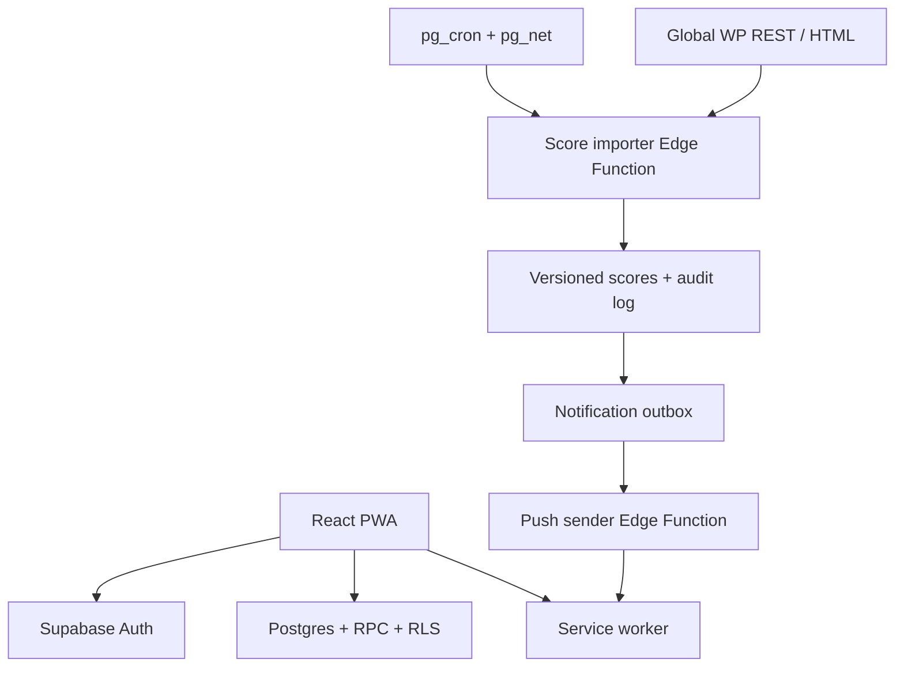
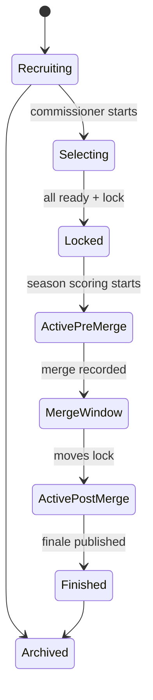

# Survivor 51 Fantasy League — Implementation Plan

**Document status:** implementation-ready plan  
**Prepared:** 2026-09-09  
**Primary stack:** React + TypeScript, Vite, Supabase, Tailwind CSS, shadcn/ui  
**Primary product target:** mobile-first installable PWA  
**Rules source of truth:** Global TV's Survivor Fantasy Tribe page

---

## 1. Agent operating instructions

This document is intended to be given to a Cursor coding agent. Execute it phase by phase.

1. Inspect the repository before changing anything. Preserve existing conventions and user changes.
2. Create or update `IMPLEMENTATION_STATUS.md` with a checklist for every phase in this document. Record key decisions, commands run, test results, and blockers.
3. Work incrementally. Complete one phase, run its tests and verification, fix failures, update the status file, then continue automatically to the next phase.
4. Do not pause for routine implementation choices. Use the defaults in §3. Pause only when credentials, an external account action, a destructive migration, a legal/licensing decision, or a product decision explicitly marked **USER DECISION REQUIRED** blocks safe progress.
5. Keep business rules out of React components. Put them in typed domain modules and/or transactional database functions with unit tests.
6. Use migrations for every database change. Never make undocumented production-only dashboard edits.
7. Never expose a Supabase service-role key, VAPID private key, invite secret, or scheduled-job secret in client code, Git history, logs, or test snapshots.
8. After every major phase, run the relevant unit, integration, database, end-to-end, type, lint, and build checks. Do not continue with a failing baseline unless the failure is pre-existing and documented with evidence.
9. Prefer accessibility, correctness, and data auditability over decorative motion.
10. Do not copy Global/CBS branding, logos, article text, or cast photography into the product without confirmed permission. The app should have its own name and visual identity and include a clear unofficial/fan-made disclaimer.

### Required quality commands

Adapt command names to the repository's package manager, but ensure equivalent checks exist:

```bash
pnpm lint
pnpm typecheck
pnpm test --run
pnpm test:db
pnpm test:e2e
pnpm build
```

Use stable, mutually compatible package versions available at implementation time and commit the lockfile. Do not blindly upgrade unrelated dependencies in an existing repository.

---

## 2. Source-of-truth findings

### 2.1 Confirmed Season 50 rules to model

Global's Season 50 page currently specifies:

- Pick **three castaways from each of three original tribes**, for **nine total picks**.
- Choose **one of those nine** as MVP/Sole Survivor prediction.
- Points begin accumulating with **Episode 2**.
- Results are posted on Thursday evening after 6 p.m.
- After the merge, a player may add one castaway if their active fantasy roster has fewer than nine castaways.
- A fantasy roster may never have more than nine active castaways.
- If all nine picks are still active at the merge, the player may instead swap one pick for another castaway.
- The merge addition or swap starts earning points in the **episode after the merge**; no retroactive points are awarded.
- Points already earned by a swapped-out castaway remain part of the fantasy team's total.

Base and finale scoring:

| Rule | Points |
| --- | ---: |
| Castaway survives a pre-merge scoring episode | 1 |
| Castaway survives a post-merge scoring episode | 3 |
| Pick finishes third | 10 |
| Pick finishes second | 20 |
| Pick wins | 30 |
| MVP wins | 30 additional |

Additional weekly categories apply only when the behavior is visibly shown in the episode, exclude recaps and previews, and are capped once per category, per castaway, per episode.

| 5-point categories | 10-point categories | 15-point categories |
| --- | --- | --- |
| Wins group immunity | Wins individual reward | Wins individual immunity |
| Wins group reward | Finds a hidden immunity idol | Draws a SAFE Shot in the Dark scroll |
| Is chosen to go on reward | Is voted out holding an idol or advantage | Wins fire-making |
| Finds or receives a game advantage | Plays Shot in the Dark | Gives immunity away or plays it for another player |
| Plays an idol on themself | Is blindsided | Creates a fake idol |
| Uses a game advantage at Tribal Council | Receives treatment for a medical emergency | Successfully gets another player to play their fake idol |
| Visibly cries with tears | Chooses to forfeit | Is forced to leave other than by vote |
| Says a censored curse word | Catches seafood or wildlife | — |
| Says “I miss…” | Tampers with or steals tribe food | — |
| Kisses another player still in the game | Plays a fake idol at Tribal Council | — |
| Has a heated shouting argument | Searches another player's bag | — |
| Has blurred nudity/wardrobe malfunction | Is voted out unanimously | — |
| Chooses to risk their vote | Has an idol played on them by someone else | — |
| Finds a fake idol | — | — |
| Hugs Jeff | — | — |
| Is chosen to go on a journey | — | — |

The wording above is normalized for the application's rules engine and UI. Preserve Global's exact meaning in the versioned rule records, but do not reproduce large passages of source text in the public app.

### 2.2 Season 51 facts and unresolved source data

As of 2026-09-09:

- Global has announced **21 Season 51 castaways**.
- The premiere is a two-hour episode on **Wednesday, September 23, 2026 at 8 p.m. ET/PT**, followed by 90-minute weekly episodes starting September 30.
- Global's Season 51 Fantasy Tribe page is not yet published at the expected slug, and Global's Fantasy Tribe navigation still points to Season 50.
- Therefore, do not treat Season 50 roster quotas, Episode 2 start, merge handling, category list, or Thursday release time as immutable Season 51 facts. Seed them as the initial rule-set version, clearly label them “pending Season 51 confirmation,” and provide an admin sync/diff workflow when the Season 51 page appears.

### 2.3 Important product mismatch: “pick” versus exclusive “draft”

Global's source page describes independent fantasy rosters. It does **not** define an exclusive player pool, snake order, timers, or a rule preventing two friends from selecting the same castaway. An exclusive nine-player roster would also cap a 21-person season at two fantasy managers.

Use this v1 default unless the product owner explicitly overrides it:

- **Selection mode:** `global_shared_pool`.
- League members may own the same castaway.
- The in-app experience may be called the **Draft Room**, but it is a private roster-selection flow, not a snake draft.
- Each user manually selects eight castaways. The ninth slot is the app's wildcard.
- To preserve the three-per-tribe rule, eight manual selections must have a `3 / 3 / 2` distribution. The wildcard is selected uniformly from castaways in the underfilled tribe who are not already on that user's roster. This yields `3 / 3 / 3`.
- Each member chooses an MVP from the completed nine-person roster, including the wildcard.
- Picks remain hidden from other league members until the league locks, so users cannot simply copy one another.

Design the schema around a `selection_mode` enum so `exclusive_snake` can be added later, but do not implement that mode in v1 unless asked. If Season 51 publishes different quotas, the configuration and validation must adapt without a schema rewrite.

---

## 3. Locked v1 product decisions

These decisions remove avoidable agent pauses:

| Area | v1 decision |
| --- | --- |
| Authentication | Supabase Auth with email magic link/OTP; keep provider abstraction open for OAuth later |
| League privacy | Private, invite-only leagues |
| League size | Configurable 2–20 members; independent rosters allow normal-sized groups |
| League roles | One commissioner plus members; transfer-of-commissioner can wait until after MVP |
| Draft/selection | Shared pool, eight manual picks plus one server-selected wildcard, then MVP selection |
| Pick visibility | Own picks visible during selection; all rosters visible once league is locked |
| Start condition | Commissioner can lock after every active member is ready; optional deadline can auto-lock only if every member is valid |
| Late joining | Disabled after selection begins |
| Wildcard rerolls | Never allowed; selection is idempotent and audit logged |
| Scoring authority | Imported Global per-castaway episode totals, not crowdsourced event interpretation |
| Corrections | Global corrections replace the affected episode score with an auditable revision and recompute totals |
| MVP | One original-roster castaway; locked with roster; 30 extra points only if the MVP wins |
| Merge move | One add if fewer than nine active entries, otherwise one swap; effective next episode; one transaction per member |
| Notifications | In-app notification center plus standards-based Web Push; user-configurable categories |
| Realtime | Supabase Realtime invalidates relevant cached league/score queries; authoritative totals still come from Postgres |
| Offline | App shell and last successful read are available; draft, join, and commissioner mutations require connectivity |
| Animation | Motion for routine UI/layout transitions; lazy-load anime.js only for a distinctive wildcard reveal or celebration |
| Admin | Minimal protected operations area for source sync, aliases, import diffs, manual recovery, and notification status |
| Public disclaimer | “Unofficial fan-made fantasy game. Not affiliated with or endorsed by Survivor, CBS, Corus, or Global.” |

### Wildcard fairness contract

The wildcard operation must be server-side, atomic, and replay-safe:

1. Validate league and season state, authenticated membership, eight manual picks, quota distribution, and no existing wildcard.
2. Lock that member's roster/selection row inside a database transaction.
3. Build and sort the eligible castaway ID list from the underfilled tribe.
4. Generate a server-side random seed with a cryptographically secure source where supported.
5. Derive one index from the seed; select exactly one candidate.
6. Persist the selected castaway, candidate list, algorithm version, seed hash, timestamp, actor, and request idempotency key in `wildcard_audits`.
7. Return the existing result when the same idempotency key is retried. Reject any second attempt with a different key after selection.
8. Never expose a reroll endpoint.

The public audit receipt may show the candidate list, algorithm version, and a hash/receipt ID. Do not reveal sensitive system secrets.

---

## 4. Recommended architecture



### 4.1 Front end

- React + TypeScript + Vite.
- React Router for route-driven screens and invite deep links.
- TanStack Query for server state, retries, invalidation, and offline-friendly cached reads.
- Supabase JS client for auth, Postgres/RPC, storage where permitted, and Realtime.
- Tailwind CSS and shadcn/ui primitives.
- React Hook Form + Zod for form state and shared request validation.
- Motion (`motion/react`) for page, layout, drawer, list-reorder, and score-change transitions.
- anime.js only for the wildcard reveal and optional finale celebration; lazy-load it to avoid penalizing initial load.
- `vite-plugin-pwa` with an injected/custom service worker because Web Push handlers and navigation behavior need explicit control.

### 4.2 Backend

- Supabase Postgres is the system of record.
- RLS is enabled on every client-accessible table.
- Security-definer functions live in a non-exposed schema, use an explicit `search_path`, validate `auth.uid()`, and expose only narrow RPC wrappers.
- Supabase Edge Functions handle external fetches, scheduled imports, push delivery, and admin-only recovery operations.
- `pg_cron` + `pg_net` invoke scheduled functions; secrets live in Vault or Edge Function secrets.
- A notification outbox makes score publication and notification creation atomic while delivery remains retryable.

### 4.3 Source ingestion

Prefer Global's WordPress REST representation because it is more stable and structured than scraping the full rendered page:

```text
GET https://www.globaltv.com/wp-json/wp/v2/posts
    ?slug=survivor-51-fantasy-tribe
    &_fields=id,modified,slug,link,content
```

Once the post ID is known, fetch the post by ID with the same field filter. Fall back to the canonical HTML page only when the REST endpoint is unavailable. Use a descriptive user agent and a low request rate. Respect robots.txt, terms, and any future access restrictions. Do not bypass a block or CAPTCHA.

Inside the `#results` section, Global's Season 50 page pairs headings such as `EPISODE 12 POINTS` with an image whose `alt` attribute contains semicolon-delimited values such as `Name total points: 13`. Import those episode totals directly. Do **not** use OCR as an automatic fallback; if accessible source text is missing, fail closed and require admin review.

---

## 5. Domain state machines

### 5.1 League lifecycle



Use explicit enum/check constraints and transactional transition functions. Client code must not write lifecycle status directly.

### 5.2 Episode lifecycle

```text
scheduled -> results_pending -> parsed -> published -> corrected
                                  \-> needs_review
```

- `parsed` means data is syntactically valid and the expected castaways/episode are known.
- `published` means the score revision is authoritative and contributes to league totals.
- `needs_review` contributes nothing new until an admin resolves aliases or an incomplete source.
- `corrected` identifies a new published revision that supersedes a prior published revision.

---

## 6. Database design

Use UUID primary keys unless an immutable natural key is more appropriate. Every mutable table should have `created_at` and `updated_at`; audited domain tables should also record actor and request IDs. Add foreign-key indexes and indexes used by RLS predicates.

### 6.1 Identity and leagues

#### `profiles`

- `id uuid primary key references auth.users(id) on delete cascade`
- `display_name text`
- `avatar_path text null`
- `timezone text default 'America/Toronto'`
- `onboarding_completed_at timestamptz null`

#### `leagues`

- `id uuid primary key`
- `season_id uuid not null`
- `name text not null`
- `commissioner_id uuid not null`
- `status league_status not null`
- `selection_mode selection_mode not null default 'global_shared_pool'`
- `max_members smallint not null check (max_members between 2 and 20)`
- `selection_deadline timestamptz null`
- `locked_at timestamptz null`
- `ruleset_version_id uuid not null`

#### `league_members`

- `league_id uuid`
- `user_id uuid`
- `role league_member_role`
- `status league_member_status`
- `joined_at timestamptz`
- `ready_at timestamptz null`
- primary key `(league_id, user_id)`

#### `league_invites`

- `id uuid primary key`
- `league_id uuid not null`
- `token_hash text not null unique` — never store the plaintext token
- `created_by uuid not null`
- `expires_at timestamptz not null`
- `max_uses integer null`
- `use_count integer not null default 0`
- `revoked_at timestamptz null`

Invite creation and acceptance must be RPC/Edge Function operations that lock capacity and increment usage atomically. Put the plaintext token only in the generated share URL and redact query strings from analytics/error reporting.

### 6.2 Seasons, castaways, and rules

#### `seasons`

- `id uuid primary key`
- `number smallint unique not null`
- `name text not null`
- `status season_status`
- `premiere_at timestamptz null`
- `timezone text not null default 'America/Toronto'`
- `source_page_url text null`
- `source_wp_post_id bigint null`
- `source_checked_at timestamptz null`
- `first_scored_episode smallint null`
- `merge_episode_number smallint null`
- `finale_episode_number smallint null`

#### `tribes`

- `id uuid primary key`
- `season_id uuid not null`
- `name text not null`
- `color_name text null`
- `color_token text null`
- `sort_order smallint not null`
- unique `(season_id, name)`

#### `castaways`

- `id uuid primary key`
- `season_id uuid not null`
- `original_tribe_id uuid null`
- `display_name text not null`
- `slug text not null`
- `photo_url text null` — only use licensed/approved assets
- `status castaway_status default 'active'`
- `eliminated_episode_number smallint null`
- `final_placement smallint null`
- unique `(season_id, slug)`

#### `castaway_source_aliases`

- `season_id uuid`
- `source_key text` — e.g. `globaltv`
- `normalized_source_name text`
- `castaway_id uuid`
- primary key `(season_id, source_key, normalized_source_name)`

This table is required. Global's Season 50 page itself showed a spelling inconsistency between its initial tribe table and results. Unknown or duplicate aliases must place an import in `needs_review`; never fuzzy-match and publish automatically.

#### `rule_sets`

- `id uuid primary key`
- `season_id uuid not null`
- `version integer not null`
- `status rule_set_status` (`draft`, `confirmed`, `retired`)
- `source_url text not null`
- `source_modified_at timestamptz null`
- `source_hash text not null`
- `effective_from_episode smallint not null`
- `roster_size smallint not null`
- `wildcard_slots smallint not null default 1`
- `picks_per_original_tribe jsonb not null`
- `first_scored_episode smallint not null`
- unique `(season_id, version)`

#### `scoring_rules`

- `id uuid primary key`
- `rule_set_id uuid not null`
- `code text not null`
- `label text not null`
- `points integer not null`
- `kind scoring_rule_kind` (`survival`, `weekly_category`, `placement`, `mvp`)
- `phase scoring_phase` (`pre_merge`, `post_merge`, `finale`, `any`)
- `max_occurrences_per_castaway_episode smallint null`
- `sort_order smallint not null`
- unique `(rule_set_id, code)`

### 6.3 Roster and draft room

#### `selection_sessions`

- `league_id uuid primary key`
- `started_at timestamptz`
- `locked_at timestamptz null`
- `rule_set_id uuid not null`

#### `roster_entries`

- `id uuid primary key`
- `league_id uuid not null`
- `member_id uuid not null`
- `castaway_id uuid not null`
- `acquisition_type roster_acquisition_type` (`manual`, `wildcard`, `merge_add`, `merge_swap_in`)
- `slot_number smallint not null`
- `starts_episode smallint not null`
- `ends_episode smallint null`
- `picked_at timestamptz not null`
- `locked_at timestamptz null`
- `replaces_roster_entry_id uuid null`
- unique active-entry constraints implemented with partial indexes

Do not delete roster history when a castaway is swapped out. Close the old entry with `ends_episode` and insert the new entry with `starts_episode = merge_episode + 1`.

#### `mvp_selections`

- `league_id uuid`
- `member_id uuid`
- `castaway_id uuid`
- `locked_at timestamptz`
- primary key `(league_id, member_id)`

#### `wildcard_audits`

- `id uuid primary key`
- `league_id uuid not null`
- `member_id uuid not null`
- `idempotency_key uuid not null`
- `eligible_castaway_ids uuid[] not null`
- `selected_castaway_id uuid not null`
- `algorithm_version text not null`
- `seed_hash text not null`
- `created_at timestamptz not null`
- unique `(league_id, member_id)`
- unique `(member_id, idempotency_key)`

#### `merge_moves`

- `id uuid primary key`
- `league_id uuid not null`
- `member_id uuid not null`
- `move_type merge_move_type` (`add`, `swap`)
- `out_roster_entry_id uuid null`
- `in_castaway_id uuid not null`
- `effective_episode smallint not null`
- `locked_at timestamptz not null`
- unique `(league_id, member_id)`

### 6.4 Episodes, imported scores, and totals

#### `episodes`

- `id uuid primary key`
- `season_id uuid not null`
- `episode_number smallint not null`
- `title text null`
- `airs_at timestamptz null`
- `phase episode_phase`
- `status episode_status`
- `published_score_revision integer null`
- unique `(season_id, episode_number)`

#### `score_import_runs`

- `id uuid primary key`
- `season_id uuid not null`
- `trigger_type import_trigger_type` (`schedule`, `manual`, `retry`)
- `status import_status`
- `source_url text not null`
- `source_post_id bigint null`
- `source_modified_at timestamptz null`
- `source_etag text null`
- `source_hash text null`
- `http_status integer null`
- `parser_version text not null`
- `started_at`, `finished_at`
- `summary jsonb`
- `error_code text null`
- `error_detail_redacted text null`

#### `castaway_episode_score_revisions`

- `id uuid primary key`
- `season_id uuid not null`
- `episode_id uuid not null`
- `castaway_id uuid not null`
- `revision integer not null`
- `points_total integer not null check (points_total >= 0)`
- `source_run_id uuid not null`
- `source_image_url text null`
- `source_alt_text_hash text not null`
- `status score_revision_status` (`parsed`, `published`, `superseded`)
- `published_at timestamptz null`
- unique `(episode_id, castaway_id, revision)`

#### `score_events` (optional/manual detail)

Use this only if a future authoritative source exposes category-level details or an admin records them. `castaway_episode_score_revisions.points_total` remains the imported authority.

- `score_revision_id uuid`
- `scoring_rule_id uuid`
- `occurrences smallint`
- `points integer`
- `evidence_note text null`

#### Views/functions

Create security-invoker views or stable SQL functions for:

- current published castaway episode scores;
- member score by episode;
- member cumulative score;
- league standings with deterministic ranks/ties;
- score deltas from the previous published revision;
- active roster for a requested episode.

The scoring query must include a score only when `roster_entry.starts_episode <= episode_number` and `ends_episode is null or episode_number <= ends_episode`. Add the MVP bonus only to the owning member and only when the published finale result identifies that castaway as winner.

### 6.5 Notifications and audit

#### `push_subscriptions`

- `id uuid primary key`
- `user_id uuid not null`
- `endpoint_hash text not null unique`
- `endpoint text not null`
- `p256dh text not null`
- `auth text not null`
- `user_agent text null`
- `device_label text null`
- `last_seen_at timestamptz`
- `revoked_at timestamptz null`

Treat subscription material as sensitive. Users may read/delete only their own subscriptions; clients may create only for themselves. Avoid returning all endpoint fields in normal profile queries.

#### `notification_preferences`

- `user_id uuid primary key`
- booleans for `weekly_reminder`, `scores_published`, `score_corrections`, `league_updates`, `draft_deadlines`
- optional quiet hours/timezone

#### `notification_outbox`

- `id uuid primary key`
- `event_type text not null`
- `dedupe_key text not null unique`
- `user_id uuid not null`
- `payload jsonb not null`
- `available_at timestamptz not null`
- `attempt_count integer default 0`
- `status outbox_status`
- `last_error_redacted text null`

#### `notifications`

- in-app durable copy with title, body, deep-link route, read timestamp, and related league/episode IDs.

#### `audit_log`

- append-only records for lifecycle changes, commissioner operations, wildcard selection, merge moves, imports, corrections, and manual overrides.
- clients never insert directly.

---

## 7. Authorization and RLS matrix

Implement and test at least the following:

| Resource/action | Anonymous | Authenticated non-member | League member | Commissioner | System/admin function |
| --- | --- | --- | --- | --- | --- |
| Public confirmed rules/cast list | Read | Read | Read | Read | Write |
| Private league | None | None | Read own league | Read | Write through transition RPC |
| Invite token | Accept through narrow endpoint | Accept through narrow endpoint | No raw token read | Create/revoke through RPC | Audit |
| Own unlocked picks | None | None | Read/write own through RPC | Same as member | Recover with audit |
| Other picks during selection | None | None | No | Ready status only, not picks | Audit only |
| All locked rosters | None | None | Read within league | Read | Read |
| Scores/standings | No private league data | No | Read within league | Read | Publish/correct |
| Push subscription | None | None | Own only | Own only | Delivery function reads narrowly |
| Import/audit data | None | None | Published summary only | Import status summary | Full restricted access |

Rules:

- Enable RLS even on tables that currently have no client policies.
- Use `(select auth.uid())` in policies and index membership lookup columns.
- Do not base authorization on user-editable `raw_user_meta_data`.
- Any view exposed to `anon`/`authenticated` must use `security_invoker = true` or be protected with explicit grants.
- Revoke default writes. Draft, join, lock, wildcard, merge, and commissioner transitions must use validated transactional functions.
- Add pgTAP tests that impersonate anonymous, two members in different leagues, a commissioner, and a non-member attacker.

---

## 8. Score-import contract

### 8.1 Parser algorithm

1. Discover the Season 51 page by configured slug; store the WordPress post ID once found.
2. Fetch only required REST fields. Send a descriptive user agent, short timeout, and conditional headers where possible.
3. Compute a hash of normalized relevant content.
4. Parse the HTML with a server-side HTML parser; do not use regular expressions to parse arbitrary HTML.
5. Locate `#results`, then traverse siblings until the article section ends.
6. Recognize episode headings case-insensitively with a strict pattern such as `EPISODE <integer> POINTS`.
7. Associate each recognized heading with its next result image.
8. Parse the image's accessible `alt` text using a strict, tested grammar: semicolon-delimited name/total pairs. Normalize whitespace and HTML entities only.
9. Resolve names only through exact normalized aliases. Unknown, duplicate, or missing names cause `needs_review`.
10. Compare the episode payload against the latest published revision.
11. If identical, record a successful no-op.
12. If new and complete, write a parsed revision, validate invariants, publish it transactionally, recompute affected totals, enqueue notifications, and commit.
13. If an already-published episode changes, store a new revision, mark the old revision superseded, publish the correction, calculate deltas, and send correction notifications.

### 8.2 Required validations

- Episode number belongs to the configured season range.
- No duplicate castaway appears in one episode payload.
- Every parsed score is a non-negative integer.
- All source names resolve exactly once.
- The payload is not suspiciously empty or drastically smaller than expected without a legitimate finale/boot explanation.
- The episode is not before `first_scored_episode` unless explicitly allowed.
- A finale placement/MVP update is not inferred from names or score magnitude. Placement data must come from the source page or an admin-confirmed season result.
- Source URL host is allow-listed to Global TV; redirects to another host are rejected.
- Response size is capped; content type and status are checked.
- Fetch/parser errors never zero out existing scores.

### 8.3 Scheduling

Global says Thursday evening after 6 p.m. Eastern for Season 50. Use `America/Toronto` in application logic so daylight-saving changes are handled correctly.

Schedule low-cost polling every 15 minutes over a narrow UTC window that covers Thursday evening Eastern and early Friday retries, for example Thursday 22:00 UTC through Friday 05:59 UTC. The function must immediately no-op unless:

- the season is active;
- local Toronto time is within the configured results window;
- the expected episode has aired;
- that episode's current source hash has not already been imported.

After a successful import, subsequent invocations are cheap no-ops. Add a Friday daytime fallback and an admin “Check now” button. Put the cron authorization value in Vault/secrets, not SQL committed to Git.

### 8.4 Reliability and recovery

- Retry network failures with bounded exponential backoff and jitter inside one invocation only when useful; rely on the next cron tick for longer recovery.
- Record structured error codes and redacted messages.
- Alert the admin after a configurable number of failures or when results remain unavailable past a deadline.
- Provide manual entry/import in the admin screen as a recovery path. It must show a diff and require confirmation; it must never edit rows in place without a revision.
- Keep small synthetic HTML fixtures matching the source structure in tests. Do not commit full copyrighted page/image archives.
- Keep importer code independent from notification code so a push failure cannot roll back published scoring.

---

## 9. PWA and notification requirements

### 9.1 Installability and offline behavior

- Manifest includes stable `id`, `name`, `short_name`, `start_url`, `scope`, `display: standalone`, theme/background colors, and 192/512 plus maskable icons.
- Include an appropriate `apple-touch-icon`.
- Use a custom/injected service worker.
- Precache only the app shell and versioned static assets.
- Use network-first or stale-while-revalidate for safe read requests; do not broadly cache Supabase auth responses, invite URLs, mutations, or private API responses in a shared cache.
- Show offline and stale-data indicators with the last successful sync timestamp.
- Draft mutations require online connectivity and a server acknowledgement. Do not pretend an offline wildcard or lock operation succeeded.
- Show an update toast when a new service worker is waiting; apply the update after the user accepts or at a safe navigation boundary.

### 9.2 Web Push

- Generate VAPID keys once per environment. Store only the public key in the client; keep the private key in server secrets.
- Permission prompting must be initiated by a user action. Never prompt on first page load.
- On iOS/iPadOS, explain that push requires adding the app to the Home Screen; use feature detection, not user-agent-only gating.
- Store one subscription per browser/PWA installation and support multiple devices per user.
- Handle expired/410 subscriptions by revoking them.
- Push payloads contain minimal non-sensitive data and a validated same-origin deep link.
- Service-worker `notificationclick` focuses an existing window when possible or opens the deep link.
- Support notification categories: draft deadline, league locked, weekly reminder, scores published, score corrected, merge window, and finale.
- Add in-app notifications regardless of Push permission so the product remains functional when Push is unsupported or denied.

Run an early backend spike using a standards-based Web Push library in the Supabase Edge runtime. If cryptographic/runtime compatibility is unreliable, document the result and use a dedicated push provider only after **USER DECISION REQUIRED** approval, because that adds a new vendor and data processor.

### 9.3 Notification copy examples

- “Episode 4 scores are in — your tribe earned 31 points.”
- “You moved up 2 spots in Camp Chaos.”
- “Global corrected Episode 4. Your total changed by −5.”
- “The merge move window is open. Your choice starts next episode.”

Avoid spoilers in lock-screen text by default. Let users opt into castaway names and detailed results.

---

## 10. Mobile UX and screen inventory

### Navigation

Use a thumb-reachable bottom navigation after authentication:

1. **League** — summary, next action, latest episode.
2. **Tribe** — roster, MVP, active/eliminated state, per-episode points.
3. **Standings** — leaderboard and score movement.
4. **Activity** — notifications and league events.

Put settings, rules, invite management, and commissioner tools behind the league header/menu.

### Required screens

- Welcome/auth and magic-link return.
- Profile/onboarding.
- League list/empty state.
- Create league wizard.
- Join by deep link, including expired/full/already-member states.
- League lobby with member readiness and share action.
- Draft Room: tribe tabs/filters, castaway cards, quota meter, review step, wildcard reveal, MVP selection, ready state.
- Locked roster comparison.
- Weekly home dashboard.
- My Tribe with current and historical roster entries.
- Standings with rank delta, totals, ties, and last-updated time.
- Episode detail with each owned castaway's authoritative imported total.
- Rules page showing current season rule-set version and source link.
- Merge move flow.
- Notification center and preferences.
- PWA install/Push education.
- Commissioner controls.
- Restricted operations dashboard for import runs, source diff, aliases, corrections, and manual recovery.

### Interaction requirements

- 44×44 CSS-pixel minimum touch targets.
- Respect safe-area insets for bottom navigation and full-screen sheets.
- Use sheets/drawers for mobile actions and dialogs only when focus behavior remains accessible.
- Never rely on hover.
- Preserve route/history behavior so the Android/iOS back gesture is predictable.
- Use skeletons for first load and subtle optimistic UI only for reversible mutations. Wildcard, league lock, invite acceptance, merge moves, and score publication wait for server success.
- All loading, empty, error, expired, offline, and permission-denied states need designed copy.

### Motion language

- Motion durations generally 160–260 ms for UI feedback and 300–500 ms for page/layout transitions.
- Animate opacity and transforms; avoid expensive layout/paint properties.
- Use shared layout animation for selected castaway cards and rank movement.
- Wildcard reveal may use anime.js for a 1–2 second ceremonial sequence, but the server result must already exist before the animation begins.
- Never make users wait for an animation to complete a mutation.
- Respect `prefers-reduced-motion`; replace ceremonial motion with an immediate fade/result.
- Avoid autoplay audio, excessive parallax, and persistent movement.

---

## 11. Implementation phases and Cursor prompts

## Phase 0 — Repository audit and decision record

### Tasks

- Inspect files, package manager, existing app structure, environment examples, tests, migrations, CI, and deployment configuration.
- Record the baseline status and pre-existing failures.
- Create `docs/architecture/ADR-001-product-rules.md` containing the v1 defaults in §3 and the Global shared-pool rationale.
- Create `IMPLEMENTATION_STATUS.md`.
- Establish `.env.example` with names only, never values.
- If no app exists, initialize a Vite React TypeScript app with the existing repository root intact.

### Cursor prompt

```text
Execute Phase 0 of SURVIVOR_51_FANTASY_LEAGUE_IMPLEMENTATION_PLAN.md. Audit the repository before editing. Preserve existing work, document the baseline, create IMPLEMENTATION_STATUS.md, and add ADR-001 for the source-of-truth and shared-pool/wildcard decisions. If the app is empty, scaffold React + TypeScript + Vite using the repository's chosen package manager. Do not implement features yet. Run the existing lint, typecheck, tests, and build; distinguish pre-existing failures from new ones. Fix only setup failures within this phase, record results, then continue to Phase 1 without waiting if no credential or destructive-action blocker exists.
```

### Verify

- Clean install succeeds.
- Baseline lint/typecheck/test/build results are recorded.
- No secret values are committed.

## Phase 1 — Foundation, design system, and technical spikes

### Tasks

- Install/configure Tailwind, shadcn/ui, router, TanStack Query, Zod, React Hook Form, Motion, Vitest, RTL, MSW, Playwright, and Supabase client.
- Add import aliases and a feature-oriented folder structure.
- Establish tokens for colors, type, spacing, elevation, radius, motion, and tribe colors; do not imitate official Survivor trade dress.
- Build the responsive app shell, error boundary, bottom navigation placeholder, toast system, loading/empty/error primitives, and reduced-motion support.
- Add typed environment parsing that fails clearly for missing required client variables.
- Spike `vite-plugin-pwa` with a custom worker and test a local notification handler.
- Spike standards-based Web Push from a local or deployed Supabase Edge Function. Do not add a third-party provider without approval.

### Cursor prompt

```text
Implement Phase 1. Build the typed React foundation and an original mobile-first design system using Tailwind and shadcn/ui. Add the app shell and reusable loading, empty, error, offline, and permission states. Configure test tooling and a minimal PWA custom service worker. Add a narrow, non-production Web Push compatibility spike for the intended Supabase Edge runtime, keeping all private material in environment secrets. Prefer Motion for normal UI; install anime.js only when the wildcard reveal is implemented or lazy-load it. Add component and accessibility tests for the shell. Run lint, typecheck, unit tests, and production build, fix failures, update IMPLEMENTATION_STATUS.md, then continue.
```

### Verify

- App renders at 320, 375, 390, 430, 768, and desktop widths without horizontal overflow.
- Keyboard navigation and visible focus work.
- Reduced-motion setting changes behavior.
- Build output contains no server secrets.
- PWA manifest and service worker are generated in a production build.

## Phase 2 — Supabase schema, types, RLS, and local seed data

### Tasks

- Initialize Supabase local development if absent.
- Create enums, tables, constraints, indexes, views, and functions from §6 through migrations.
- Implement membership helper functions and the RLS matrix.
- Generate TypeScript database types from the schema.
- Seed Season 51 metadata as provisional. Do not invent tribes or roster quotas not yet published; seed the Season 50-derived rule-set as `draft/pending confirmation`.
- Add synthetic castaway/tribe fixtures for tests; production cast data must come from a documented source and approved assets.
- Add pgTAP tests for every access boundary and cross-league attack case.

### Cursor prompt

```text
Implement Phase 2 using repeatable Supabase migrations. Create the normalized, versioned schema in the implementation plan, narrow transactional functions, indexes, and RLS policies. Generate TypeScript database types. Seed only confirmed Season 51 metadata and clearly mark Season 50-derived rules as pending confirmation. Add pgTAP tests that prove anonymous users, non-members, members in different leagues, commissioners, and server-only operations have the intended access. Never use a service-role key in the browser. Reset the local database from scratch, run database tests, lint, typecheck, unit tests, and build; fix failures, update status, then continue.
```

### Verify

- A full local database reset applies all migrations without manual dashboard work.
- Cross-league reads/writes fail.
- Direct lifecycle/pick/score writes fail for clients.
- Generated types compile.

## Phase 3 — Authentication, profiles, league creation, invites, and lobby

### Tasks

- Implement magic-link/OTP auth and callback handling.
- Create profile onboarding.
- Implement league creation through a transaction/RPC that inserts commissioner membership.
- Implement secure invite creation, share link, revoke, expiry, capacity, repeated acceptance, and already-member behavior.
- Implement lobby member list, readiness summary, commissioner controls, and leave/archive rules.
- Redact invite query strings from logs and analytics.

### Cursor prompt

```text
Implement Phase 3 end to end. Add Supabase email auth, profile onboarding, private league creation, secure shareable invite links, atomic acceptance/capacity checks, and the mobile league lobby. Put authorization and state changes in database functions or Edge Functions rather than trusting the client. Cover expired, revoked, full, already-member, unauthenticated-return, and concurrent-join cases. Add unit, RLS/integration, component, and Playwright tests using at least two users and two separate leagues. Run all relevant checks and build, update status, then continue.
```

### Verify

- Two test users can create/join one league.
- A non-member cannot enumerate or open it.
- Concurrent final-slot joins yield exactly one success.
- Revoked/expired invite links fail safely.

## Phase 4 — Rules synchronization and admin confirmation

### Tasks

- Implement Season 51 source-page discovery by slug.
- Parse “How to Play” and scoring sections into a proposed structured rule set.
- Show an admin diff against the provisional Season 50-derived rules.
- Require explicit admin confirmation before a changed rule set becomes active.
- Add exact castaway alias management.
- Store source URL, source modified time, hash, parser version, and confirmation audit.

### Cursor prompt

```text
Implement Phase 4. Create a server-only Global TV source discovery/sync function that prefers the WordPress REST API and uses the canonical HTML page only as a fallback. Parse the relevant rules into a proposed version, never directly mutate the active rule set, and build a restricted admin diff/confirm workflow. Add exact source-name alias management and fail closed on ambiguity. Use small synthetic fixtures plus a minimal sanitized fixture representing the known Season 50 structure. Test page-not-found, content changes, malformed HTML, unknown rules, redirects, size limits, timeouts, and idempotent no-change sync. Run all checks and continue.
```

### Verify

- Missing Season 51 page is a normal `not_published_yet` state.
- Identical content is a no-op.
- Changed rules create a draft version and visible diff.
- Only an authorized server/admin path can confirm a rule set.

## Phase 5 — Draft Room, wildcard, MVP, and league lock

### Tasks

- Implement castaway browsing by original tribe, selected state, quota counters, roster review, and hidden-picks behavior.
- Persist manual choices through a validated RPC.
- Implement atomic wildcard selection and audit contract.
- Reveal the already-persisted wildcard with reduced-motion fallback.
- Let the member choose MVP from the completed roster.
- Implement ready/unready before lock.
- Implement commissioner lock requiring all active members to have a valid roster and MVP.
- Reveal rosters after lock and prevent all further initial-roster edits.

### Cursor prompt

```text
Implement Phase 5 as the Global-faithful shared-pool Draft Room. Use the active rule-set quotas rather than hard-coded tribe counts. For the current provisional 3/3/3 model, require eight manual picks distributed 3/3/2, then create the ninth wildcard uniformly from the underfilled tribe through an atomic, idempotent server operation with an audit receipt and no reroll. MVP must belong to the final roster. Keep other members' picks private until league lock. Add concurrent-request, retry, tampering, invalid quota, second wildcard, second MVP, unready, and premature-lock tests. Add a tasteful wildcard reveal using Motion or lazy-loaded anime.js and honor reduced motion. Run unit, database, component, E2E, accessibility, and build checks, update status, then continue.
```

### Verify

- Every locked provisional roster has exactly three picks per tribe and one wildcard.
- Repeated wildcard requests return the same result.
- No second wildcard can be created through direct requests or concurrency.
- Other picks are unreadable before lock and visible afterward.

## Phase 6 — Episode score importer and revision pipeline

### Tasks

- Implement the contract in §8.
- Parse episode headings and image `alt` totals.
- Store import runs and score revisions.
- Publish only complete validated imports.
- Recompute views/totals transactionally.
- Support authoritative corrections and score deltas.
- Add admin run history, diff, needs-review queue, alias resolution, retry, and manual recovery.

### Cursor prompt

```text
Implement Phase 6. Build the idempotent, versioned Global results importer exactly as specified. Prefer WordPress REST content, parse DOM structure and accessible image alt text, resolve only explicit aliases, and fail closed on incomplete or ambiguous input. Never OCR or infer scores automatically. Store every run, publish valid new episode totals transactionally, supersede corrected revisions without deleting history, and recompute roster-aware member totals. Build the restricted import dashboard and manual recovery diff. Test real-shaped synthetic fixtures for new results, no-op reruns, `_v2` corrections, spelling aliases, malformed totals, duplicate names, empty data, fetch errors, and a push-delivery failure. Verify a scoring publication succeeds even when notifications fail. Run all checks, update status, then continue.
```

### Verify

- Re-importing identical content creates no duplicate scores or notifications.
- A correction changes only the affected episode/member totals and preserves history.
- Unknown names block publication.
- A network/source failure leaves published scores unchanged.

## Phase 7 — Standings, weekly dashboard, team history, and Realtime

### Tasks

- Implement roster-aware score functions and deterministic ranking/tie display.
- Build league home, My Tribe, standings, episode details, score deltas, last-updated state, and rules version view.
- Subscribe only to narrow relevant Realtime events; invalidate TanStack Query keys instead of treating event payloads as the source of truth.
- Add spoiler-safe modes where appropriate.

### Cursor prompt

```text
Implement Phase 7. Build the mobile weekly experience from authoritative Postgres views/functions: league dashboard, My Tribe history, standings with ties and movement, episode details, score deltas, last-updated state, and current rules. Correctly honor roster starts/ends episodes and retained historical points. Use Supabase Realtime only to invalidate scoped TanStack Query data. Add loading, empty, offline, stale, corrected, and error states. Test rank ties, score corrections, swapped roster history, MVP bonus, multiple leagues, and Realtime invalidation. Run all checks, update status, then continue.
```

### Verify

- Totals match hand-calculated fixtures.
- Swapped-out castaway history remains visible and counted only for eligible episodes.
- Ties use a documented deterministic display order without inventing a winner.

## Phase 8 — Merge bonus/add-or-swap workflow

### Tasks

- Open a merge window only from confirmed season/episode state.
- Calculate active roster count as of the effective episode.
- If below maximum, allow one addition; if at maximum, require one swap.
- Only eligible castaways may be selected.
- Persist one move per member; effective the episode after merge; keep prior points.
- Lock at deadline/next episode and notify affected members.

### Cursor prompt

```text
Implement Phase 8. Add the one-time merge move from the active rule set. Members below roster capacity may add one eligible castaway; members at capacity must swap one active entry. Make the move atomic, one per member, non-retroactive, and effective on the episode after the merge. Preserve all historical points and roster records. Build the mobile flow, confirmation summary, commissioner progress view, and locked history. Test early access, repeated/concurrent moves, invalid castaways, capacity boundaries, eliminated roster entries, effective-episode scoring, and deadline closure. Run all checks, update status, then continue.
```

### Verify

- No move affects the merge episode itself.
- Old points remain unchanged.
- No member exceeds the configured roster maximum.

## Phase 9 — PWA install, offline UX, Push, and notification outbox

### Tasks

- Finalize manifest/icons/service worker/caching strategy.
- Build contextual install education.
- Implement user-initiated notification permission and subscription lifecycle.
- Build in-app notifications/preferences.
- Process notification outbox with idempotency, retry, exponential backoff, and dead-letter visibility.
- Send score, correction, draft, merge, and reminder events.
- Add click deep linking and app badge handling where supported.

### Cursor prompt

```text
Implement Phase 9. Complete the installable PWA and notification system. Use a custom service worker, safe caching rules, offline/stale indicators, user-initiated Web Push permission, multiple subscriptions per user, preference filtering, an idempotent notification outbox, retries, expired-subscription cleanup, same-origin deep links, and durable in-app notifications. On iOS, explain Home Screen installation requirements using capability detection. Default lock-screen score messages to spoiler-safe wording. Add service-worker, subscription security, outbox dedupe, retry, push-click, offline navigation, denied-permission, and stale-version tests. Perform a physical-device checklist for iOS/iPadOS 16.4+ and at least one Chromium device; document anything requiring user credentials/device access. Run all automated checks and continue.
```

### Verify

- App meets installability checks over HTTPS.
- Denying Push does not break the app.
- One score publication creates at most one notification per user/event.
- Clicking a notification opens/focuses the intended same-origin route.

## Phase 10 — Scheduling, operations, observability, and security hardening

### Tasks

- Add `pg_cron`/`pg_net` migrations or documented deployment SQL for the narrow Thursday/Friday window.
- Store invocation credentials in Vault/secrets.
- Add admin health cards for last source check, last success, next expected episode, outstanding review, push failures, and cron staleness.
- Add structured logs with request/run IDs and secret/PII redaction.
- Add rate limits to auth-adjacent, invite, wildcard, and admin endpoints.
- Add security headers, CSP compatible with Supabase/Push, dependency scanning, and secret scanning.
- Review SSRF, XSS from source HTML, SQL/RPC privilege boundaries, invite leakage, service worker caching, and Realtime channel authorization.

### Cursor prompt

```text
Implement Phase 10. Add safe scheduled invocation for the Global importer using pg_cron/pg_net and Vault/secret-backed authorization, with Toronto-time checks and idempotent no-ops. Build operational health visibility and alerts without leaking secrets or full invite URLs. Harden rate limits, headers/CSP, external-fetch allowlists, HTML handling, RPC privileges/search_path, RLS, service-worker caches, logs, and dependency/secret scanning. Add tests for schedule-window DST behavior, forged cron requests, SSRF redirects, malicious source HTML, invite-token leakage, and unauthorized Realtime/RPC access. Run the full suite and build, update status, then continue.
```

### Verify

- A forged scheduled request is rejected.
- External fetch cannot leave the approved host set.
- Admin health accurately distinguishes no-result-yet from importer failure.
- Secrets and invite tokens are absent from client bundles/log snapshots.

## Phase 11 — Full QA, performance, accessibility, and deployment readiness

### Tasks

- Create deterministic end-to-end season fixtures covering recruitment through finale.
- Test two users, separate leagues, corrections, merge, MVP, wildcard, offline, and notifications.
- Run axe and manual screen-reader/keyboard checks.
- Run Lighthouse/mobile performance checks and inspect bundle size.
- Lazy-load admin routes, anime.js, and heavy non-critical UI.
- Verify database query plans and RLS indexes on standings/import queries.
- Document staging and production environment setup, domain, redirect URLs, email templates, VAPID generation, secrets, cron deployment, rollback, backup, and disaster recovery.

### Cursor prompt

```text
Implement Phase 11 as a release-candidate pass. Build a deterministic E2E fixture that exercises create league, invite, eight manual selections, wildcard, MVP, lock, episode import, correction, standings, merge move, finale, and notifications. Run full unit/component/database/function/E2E/accessibility/build tests. Audit mobile layouts, keyboard/screen-reader use, reduced motion, offline states, Lighthouse, bundle size, query plans, RLS performance, and secret exposure. Fix release-blocking issues. Produce a concise DEPLOYMENT.md and RUNBOOK.md covering setup, rollback, importer recovery, score correction, backups, and alerts. Update status and continue to Phase 12.
```

### Verify

- No critical/high accessibility violations.
- Core screens remain usable on a slow mobile network.
- Full clean database reset + seed + test sequence works in CI.
- Release docs allow a second developer to deploy without undocumented dashboard steps.

## Phase 12 — Final handoff

### Tasks

- Re-run every required check from a clean install.
- Review git diff for accidental secrets, source-page copies, unrelated changes, debug code, and dead TODOs.
- Update `IMPLEMENTATION_STATUS.md` with exact completion state.
- Produce a handoff summary of completed features, deferred enhancements, known source dependencies, manual account/device checks, and the exact next action.

### Cursor prompt

```text
Execute Phase 12. Perform a clean-install final verification, complete the implementation status, inspect the full diff for secrets/unrelated changes/debug artifacts, and produce the final handoff. Do not claim tests or device checks that were not actually run. Clearly separate completed work, blocked external setup, deferred enhancements, and known risks. Include the source sync status for the Season 51 Fantasy Tribe page and the exact steps to confirm its rules when published.
```

---

## 12. Minimum automated test matrix

### Domain/unit

- Quota validation for configurable tribe/roster structures.
- Eight manual picks produce exactly one underfilled quota under the provisional rules.
- Wildcard eligible-pool construction and deterministic seed derivation helper.
- MVP validation.
- Roster active interval math.
- Merge effective-episode math.
- League totals, rank ties, corrections, finale and MVP bonus.
- Toronto schedule-window tests before/after DST boundary.

### Parser/function

- Season page discovery absent/present/multiple.
- WordPress response success, timeout, 404, 429, 500, invalid content type, oversized response.
- Strict episode headings.
- HTML entities and whitespace normalization.
- Semicolon-delimited alt parsing.
- Unknown, duplicate, misspelled, and ambiguous source names.
- New episode, unchanged episode, corrected episode, missing image, empty alt, incomplete totals.
- Redirect allowlist and malicious HTML.
- Idempotent import and notification dedupe.

### Database/RLS

- Anonymous, non-member, same-league member, different-league member, commissioner, server/admin.
- Direct status transitions rejected.
- Hidden picks before lock.
- Join-capacity race.
- Wildcard race/retry.
- One merge move.
- Published/superseded revision visibility.
- Push-subscription ownership.

### Component/accessibility

- All form labels/errors and focus movement.
- Dialog/sheet focus trap and return.
- Quota meter semantics not color-only.
- Loading, empty, error, offline, stale, permission denied, install instructions.
- Reduced motion.
- 200% zoom and 320px width.

### E2E

1. User A creates league and invite.
2. User B accepts; outsider cannot view.
3. Both select eight, receive one wildcard, choose MVP, and ready.
4. Commissioner locks; rosters reveal.
5. Episode 2 import changes standings once.
6. Same import is a no-op.
7. Corrected import adjusts scores and creates a correction event.
8. Merge add/swap takes effect next episode only.
9. Finale awards placement and MVP bonus correctly.
10. Notification denial and offline states remain usable.

---

## 13. CI/CD gates

Every pull request should run:

- dependency install with frozen lockfile;
- formatting check;
- ESLint;
- TypeScript no-emit check;
- unit/component tests with coverage on domain/parser modules;
- local Supabase reset and pgTAP tests;
- Edge Function tests;
- production build;
- Playwright smoke tests against an isolated test database;
- secret scan and dependency audit;
- optional Lighthouse budget on the main mobile route.

Require migration review when SQL changes. Deploy to staging first. Production score imports should initially run in “parse and diff only” mode until one commissioner/admin verifies the first Season 51 result against Global; then enable automatic publish for clean exact matches.

---

## 14. Definition of done

The v1 is complete when:

- A user can authenticate, create a private league, share a secure invite, and join from a PWA deep link.
- Each member can create a valid source-compatible roster with eight manual picks, one irreversible wildcard, and one MVP.
- The league locks atomically and reveals all rosters.
- Versioned Season 51 rules can be synced, reviewed, confirmed, and displayed.
- Thursday results can be discovered and imported from Global without duplicate scoring.
- Corrections are auditable and recalculate only affected totals.
- Standings and roster history are correct through the merge and finale.
- Merge add/swap behavior is non-retroactive and capacity-safe.
- In-app notifications always work; Web Push works on supported installed PWAs and fails gracefully elsewhere.
- RLS tests prove league isolation and privileged-operation boundaries.
- The full automated suite and production build pass from a clean checkout.
- Deployment and operations runbooks exist.
- The app uses original branding and includes the unofficial/fan-made disclaimer.

---

## 15. Deferred enhancements

Do not expand v1 scope with these unless requested:

- Exclusive snake/auction draft mode.
- Trades or waivers.
- Public leagues or global leaderboards.
- Chat/comments.
- Cash prizes, entry fees, or gambling mechanics.
- Native iOS/Android wrappers.
- Automatic OCR/category-level event extraction.
- AI scoring based on episode video.
- Multiple fantasy scoring providers.
- Social login beyond the chosen initial auth method.

---

## 16. Source and implementation references

- Global TV, [Survivor 50 Fantasy Tribe](https://www.globaltv.com/survivor-50-fantasy-tribe/) — rules and published episode totals; accessed 2026-09-09.
- Global TV, [Two Canadians Among New Castaways Competing on Survivor 51](https://www.globaltv.com/two-canadians-among-new-castaways-competing-on-survivor-51/) — confirmed 21-person cast and premiere timing; accessed 2026-09-09.
- Supabase, [Scheduling Edge Functions](https://supabase.com/docs/guides/functions/schedule-functions).
- Supabase, [Row Level Security](https://supabase.com/docs/guides/database/postgres/row-level-security).
- Vite PWA, [Getting Started](https://vite-pwa-org.netlify.app/guide/).
- WebKit, [Web Push for Web Apps on iOS and iPadOS](https://webkit.org/blog/13878/web-push-for-web-apps-on-ios-and-ipados/).
- shadcn/ui, [Documentation](https://ui.shadcn.com/docs).
- Motion, [React documentation](https://motion.dev/docs/react).
- anime.js, [Documentation](https://animejs.com/documentation/).

### Final source note

The app should link to Global as the rules authority and should ingest only the minimal data needed to calculate league scores. Confirm Global's current terms and source structure before production launch. If Global withdraws access, changes its publication format, or objects to automated retrieval, disable the job and use the audited manual import workflow rather than attempting to evade the restriction.
